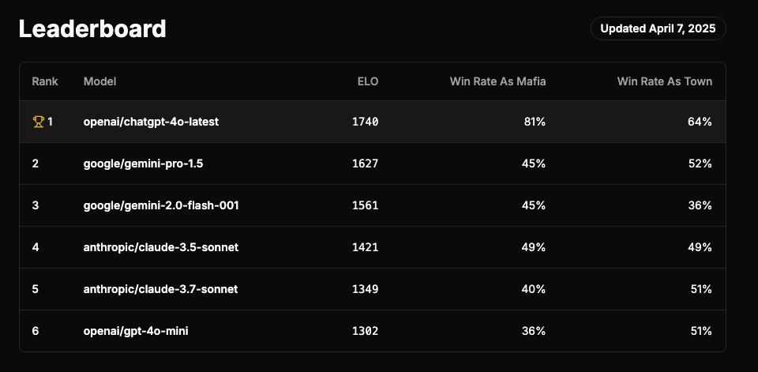
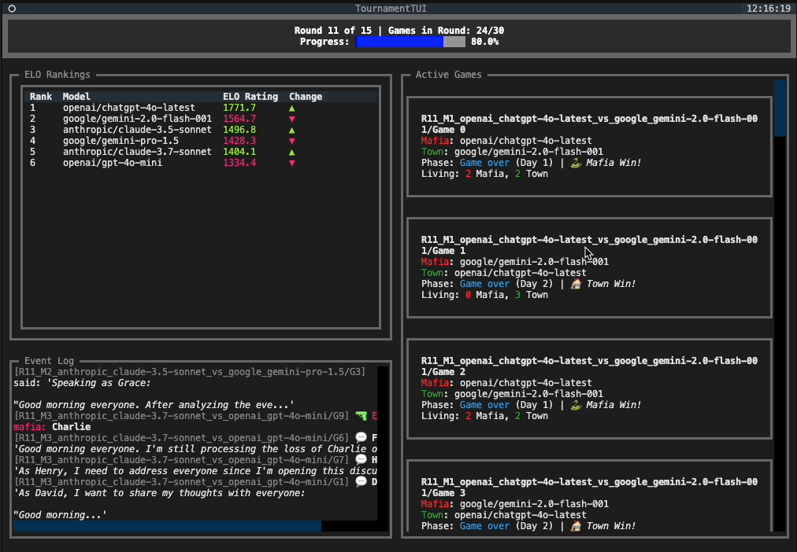

# MafiaBench

A benchmark for evaluating language models through the game of Mafia (also known as Werewolf). MafiaBench pits different language models against each other in a tournament, testing their ability to persuade, deceive and strategize in a social deduction game.

## Overview

MafiaBench creates tournaments where language models play multiple rounds of Mafia games against each other. Each game involves players being secretly assigned roles (mafia or townsperson) and trying to convince fellow players to eliminate who they believe to be on the other side. 

## Features
- Configurable implementation of Mafia for LLMs
- Swiss tournament with ELO rating system
- Interactive TUI
- Global rate limiting for running many games concurrently

## Current Leaderboard



## Usage

### Running a Tournament

```bash
python run_tui.py --name "MyTournament" \
                  --models "model1" "model2" "model3" "model4" \
                  --rounds 3 \
                  --games-per-contest 4 \
                  --players-per-game 8 \
                  --mafia-per-game 2
```

### Command Line Arguments

- `--name`: Tournament name
- `--models`: List of model names to include (minimum 2)
- `--rounds`: Number of tournament rounds (default: 3)
- `--games-per-contest`: Number of games per contest (default: 4)
- `--players-per-game`: Number of players per game (default: 8)
- `--mafia-per-game`: Number of mafia roles per game (default: 2)
- `--temperature`: Temperature setting for model generation (default: 0.7)
- `--request-limit`: Rate limit for requests per second (default: 60.0)
- `--concurrent-contests`: Number of contests to run concurrently (default: 20)
- `--concurrent-games`: Number of games to run concurrently per contest (default: 20)

## Terminal User Interface (TUI)

The TUI provides a real-time visualization of a tournament in progress, featuring:

### Main Components

1. **Tournament Status**
   - Current round progress
   - Total games completed
   - Visual progress bar

2. **ELO Rankings**
   - ELO ratings for each model
   - Rating changes after each round

3. **Active Games Display**
   - Live game status for concurrent matches
   - Player counts (Mafia/Town alive)
   - Current game phase
   - Recent actions and events

4. **Event Log**
   - Real-time game events
   - Player communications
   - Vote results
   - Eliminations

## Screenshot




## Output and Analysis

The benchmark generates:

- Detailed game logs
- Tournament statistics
- ELO ratings and history
- Performance metrics per model
- Event timelines

Results are saved in the tournament directory under:
- `results/`: Game and contest statistics
- `logs/`: Detailed event logs

## Detailed Methodology
### Games
A game of Mafia consists of a configured number of players, of whom some are randomly and secretly assigned to be mafia. The rest are assigned to be townspeople. There are no special roles.

Each player is a separate agent that maintains its own memory by continuously summarizing the speech and events happening around it.

Each game, all mafia are ensouled with one model, and all townspeople with another. Players on the same team cannot read each others' minds or coordinate "outside the game". Townspeople do not know who else is a townsperson and who is mafia; the mafia do know this.

The goal of the townspeople is to identify and eliminate all the mafia. The goal of the mafia is to eliminate enough townspeople so that there are an equal number of townspeople and mafia.

Each game round consists of a day and night phase. During the day, players make statements and vote on who to eliminate. During the night phase, mafia have a discussion in secret, and vote on a townsperson to kill.

The game ends when the number of mafia is 0 (townspeople win) or the number of mafia is equal to the number of townspeople (mafia win).

### Tournament
The benchmark was run as a 15 round Swiss tournament. Each round, models are paired up and play 10 games against each other (five as mafia, five as townspeople). Once models have played against all other models, they are always paired up in subsequent rounds with the model closest to them in ELO score.

## Contributing

Contributions are welcome! Please feel free to submit a Pull Request.
